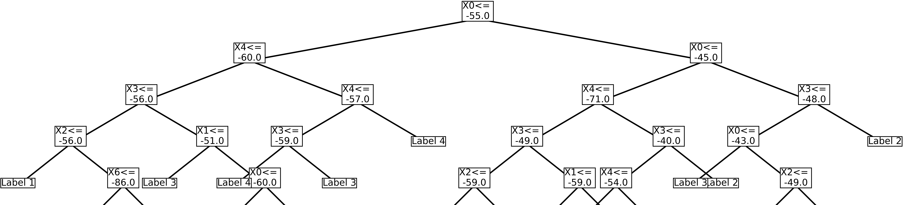

# CW1-DecisionTree

This project implements a decision tree algorithm and uses it to determine one of the indoor locations based on WIFI signal strengths collected from a mobile phone.

## How to run the code

1. Clone the repository

   ```bash
   git clone https://github.com/IC-24fall-Intro2ML/CW1-DecisionTree.git
   cd CW1-DecisionTree
   ```

2. Install the required packages

   ```bash
   pip install -r requirements.txt
   ```

3. Run the code

   ```bash
   python ML_CW1.py
   ```

## Files in the repository

- `ML_CW1.py`: The main code file that implements the decision tree algorithm and uses it to determine the indoor locations based on WIFI signal strengths.

- `data/`: A directory containing the dataset files.

- `Decision_Tree.py`: A file containing the implementation of the decision tree algorithm. (This is just a step by step implementation of the decision tree algorithm, we keep this in the repository just for reference. The final implementation is in `ML_CW1.py`)

- `README.md`: This file.

- `requirements.txt`: A file containing the required packages to run the code.

## Notice

The visualization function is implemented but commented out in the code. If you want to visualize the decision tree, you can uncomment the code in the `ML_CW1.py` file.

The reason we commented out the function is to keep the code running without any stoppage.

Here is one of the possible results of the decision tree visualization running on the **full dataset**:

